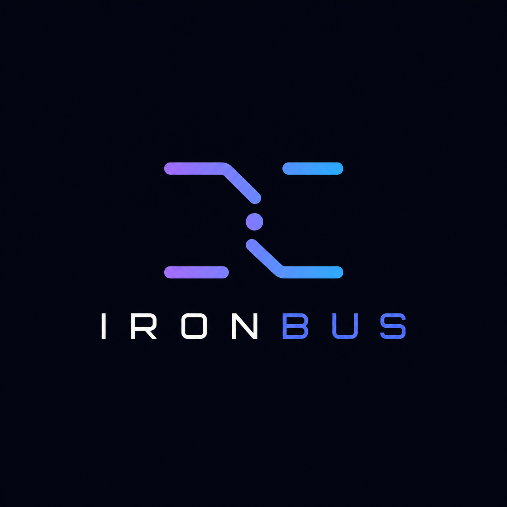

<p align="center">
  
</p>

# IronBus

**A single durable, crash-safe message queue for the edge, in one static Rust binary.**

> Status: early implementation. The architecture is vetted in the GitHub issues; the code is now being built one small, reviewed, CI-gated PR at a time. Start at the [vision EPIC (#1)](https://github.com/ELares/IronBus/issues/1).
>
> **Where this is going:** the v2 mission is for IronBus to be feature-rich and decisively better than NATS on every front, **single node or clustered**, with clustering a first-class goal (not post-1.0). Read **[docs/MISSION.md](docs/MISSION.md)** — it is scrupulously explicit about what is achieved and measured today versus what is v2 target, not yet built.

IronBus is one durable, ordered queue (think a single AWS SQS queue) that lives on the device, survives power loss and corrupt files on its own, and fans out to many consumers. It ships as a single static binary you can drop onto a Raspberry Pi. It takes the best small, composable ideas from MQTT, NATS, Kafka, Pulsar, Redpanda, RocksDB, Redis Streams, and SQS, and leaves behind the operational weight and the silent durability footguns that do not survive a battery-less edge node. The single-node durable broker is what runs today; multi-stream, subjects, and a real multi-node cluster are the v2 roadmap (see [docs/MISSION.md](docs/MISSION.md)). A KV store and an object store are non-goals: IronBus stays a pure message bus.

---

## Why IronBus exists

Every existing broker is wrong for a resilient durable-log edge workload in a different way, and each wrongness maps to one of our tenets:

- **Kafka** defaults to NOT calling `fsync` per write and leans on replication for durability. On an edge box that loses power, the page-cache loss window is real, and replicas usually share the same power rail, so the independent-failure assumption is false. It also drags in a JVM.
- **NATS Core** is beautifully simple but has no persistence. JetStream adds durability but a heavier surface.
- **MQTT** is edge-friendly and simple, but it is a protocol, not a durable, replayable log.
- **SQS** is the delivery model we want (visibility-timeout leases, dead-letter queues, dedup), but it is a managed cloud service, the opposite of embeddable and edge-first.
- **RocksDB, Pulsar, Redpanda, Redis Streams** each solved one piece beautifully (a checksummed log, segment-centric storage, a single self-contained binary, lease-based consumer groups), but none is the whole thing.

None of them is a single static cross-platform binary that self-heals against corrupt files with bounded, reported loss. IronBus exists to be exactly that intersection.

---

## The five tenets

We rank the tenets, and when two conflict we resolve in this order: **Resilient > Simple > Edge First > HyperScale > Cross Platform.**

| Tenet | What it means in practice |
| --- | --- |
| **Simple** | One logical queue, one binary, one config file with safe defaults, a tiny length-framed binary wire protocol whose stored records you can decode with the built-in `ironbus peek` and `ironbus dump` commands. Install to first message in under a minute (see the [Quick start](#quick-start-from-install-to-many-producers-and-consumers)). No ZooKeeper, no JVM, no external dependencies. |
| **Resilient** | Every acknowledged durable write survives power loss. Startup always recovers a consistent prefix. A torn tail or a poison record or segment is skipped, never fatal, with loss bounded and reported as a number. |
| **HyperScale** | High per-core throughput on edge hardware (not horizontal scale-out): a bounded ring-buffer core with structural backpressure, group-commit `fdatasync`, and zero-copy fan-out, sustaining tens of thousands of small messages per second per core. |
| **Edge First** | RAM ceilings, flash-wear budgets, and brownout behavior are first-class configuration, not afterthoughts. The queue spills to disk and sheds load rather than blocking producers or running out of memory. |
| **Cross Platform** | One static musl binary per architecture (aarch64, armv7, x86_64), kernel-only dependency, reproducible builds, embedded SBOM. |

---

## What IronBus is, and is not

**IronBus v1 IS:**

- A single durable, totally ordered, append-only log per instance (one queue), consumed by many consumers.
- At-least-once delivery with SQS-style visibility-timeout leases, redelivery, a max-deliver limit, and a dead-letter queue.
- Local-first and embeddable, durable on one node by calling `fdatasync` before it acknowledges a write.
- Self-healing: it detects corruption, skips poison records and quarantines unreadable segments, resynchronizes to the next valid record, and reports exactly what was lost.
- A single static binary that is both the broker and the CLI.

**What ships today is a single node; the rest is the v2 roadmap, not a permanent identity.** The v2
mission is for IronBus to be feature-rich and decisively better than NATS on every front, single node
**or clustered** — see [docs/MISSION.md](docs/MISSION.md). Single node is the zero-config default the
cluster degrades to, not the ceiling:

- **One log today; multi-stream, subjects, and a routing fabric are the v2 roadmap.** The shipped binary
  is one durable ordered log. Multiple streams, subject routing, and wildcards are planned (v2
  single-node milestones), not a non-goal. A KV store and an object store are non-goals: IronBus stays a
  pure message bus. Until multi-stream lands, multiple independent queues can be run as separate instances.
- **Single node today; a real cluster is the v2 roadmap, and clustering is first-class.** The shipped
  binary is single-node durable (`fdatasync` before ack). Replication is **not** a non-goal and **not**
  deferred to post-1.0: real multi-node clustering — leader/follower replication with NATS-cluster parity
  and better — is a first-class v2 goal that **preserves** every durability/recovery/edge/flash-wear
  guarantee below. The cluster ack default is `fsync`'d-on-a-quorum, and the cluster recovery invariants
  (CI1–CI4) extend the single-node bounded-and-reported-loss discipline across replicas
  ([docs/MISSION.md](docs/MISSION.md)).

**IronBus is explicitly NOT (these are durable non-goals):**

- Not exactly-once. At-least-once is the contract, with an optional fire-and-forget fast path. No exactly-once handshake.
- Not a key/value store. A KV store (the NATS JetStream KV analog) is a different product category; IronBus stays a pure message bus.
- Not an object store. Chunked object storage is out of scope. (Tiered storage of cold log segments to an object-storage backend is core log infrastructure and stays on the roadmap, which is distinct from being an object store.)
- Not a Kafka wire-protocol clone, and not a Windows product in v1 (Windows fsync and path semantics differ enough to threaten the durability guarantee).

---

## Quick start: from install to many producers and consumers

IronBus is one static binary that is **both the broker and the CLI**. Below is the whole loop: install it, start the broker on your edge device, then point producers and consumers at it. The local examples use the default address `127.0.0.1:7777`, so you can drop `--addr` when everything runs on the same box.

> Security heads-up: the wire protocol is **not yet encrypted or authenticated** (TLS and auth are designed but not implemented). Keep the broker bound to loopback or a trusted LAN behind a firewall or an SSH / WireGuard tunnel. Do not expose it to the open internet.

### 1. Install

**The seamless path (recommended).** One line auto-detects your CPU arch, downloads the matching static `musl` binary from the latest release, and verifies its checksum before installing (fail-closed, no skip-verify override):

```sh
curl -fsSL https://raw.githubusercontent.com/ELares/IronBus/main/scripts/install.sh | sh
```

Prefer to grab the binary yourself? Download the static `musl` binary for your CPU from the [latest release](https://github.com/ELares/IronBus/releases/latest), `chmod +x`, and run it (no runtime dependencies, not even a libc to install):

| Edge CPU | Asset |
| --- | --- |
| arm64 / Raspberry Pi 4 / 5 (64-bit) | `ironbus-linux-arm64` |
| armv7 / Raspberry Pi (32-bit) | `ironbus-linux-armv7` |
| x86_64 / amd64 | `ironbus-linux-amd64` |

Every push to main publishes a fresh `YYYY.MMDD.N` build (calendar-versioned, the three static binaries plus a consolidated `SHA256SUMS` and a Sigstore provenance attestation), so `releases/latest` and the installer always resolve to the newest build. See [docs/DISTRIBUTION.md](docs/DISTRIBUTION.md) for every channel.

**Prefer a container?** Every build also publishes a multi-arch (amd64 / arm64 / armv7) distroless image to `ghcr.io/elares/ironbus`, so you can pull and run without installing anything (mind the loopback / security note above):

```sh
docker pull ghcr.io/elares/ironbus:latest
docker run --rm -v ironbus-data:/var/lib/ironbus -p 127.0.0.1:7777:7777 \
  ghcr.io/elares/ironbus:latest serve --data-dir /var/lib/ironbus
```

**Build from source** (the developer / alternative path, on any host with a Rust toolchain):

```sh
git clone https://github.com/ELares/IronBus.git
cd IronBus
cargo build --release
# the single binary is now at target/release/ironbus
```

For an **edge device** without network access to the release, cross-compile the one static `musl` binary and copy it over:

```sh
rustup target add aarch64-unknown-linux-musl   # or armv7-unknown-linux-musleabihf, x86_64-unknown-linux-musl
cargo build --release --target aarch64-unknown-linux-musl
scp target/aarch64-unknown-linux-musl/release/ironbus pi@edge-device:/usr/local/bin/ironbus
```

### 2. Start the broker on the edge

The only required flag is `--data-dir` (the durable log, the consumer cursors, and the dead-letter sink all live there). Use the `edge-tiny` profile for a small-RAM, flash-gentle node:

```sh
ironbus serve --data-dir /var/lib/ironbus --profile edge-tiny
```

- `--profile edge-tiny` selects the small-RAM preset (8 MiB segments, tiny credits, 32 connections) plus a **64 MiB RAM ceiling that refuses to boot if the configured caps cannot fit**, so the broker can never surprise you by growing past its budget.
- By default the broker binds **loopback only** (`127.0.0.1:7777`) and acknowledges a write **only after `fdatasync`**, so a power cut loses zero acknowledged messages. To let producers and consumers on **other machines** reach it, bind the device's address (mind the security note above):

  ```sh
  ironbus serve --data-dir /var/lib/ironbus --profile edge-tiny --addr 0.0.0.0:7777
  ```

- Optional health and metrics: add `--health-addr 127.0.0.1:9090` to expose `GET /healthz`, `/readyz`, and `/metrics`.
- `Ctrl-C` (or `SIGINT` / `SIGTERM`) stops gracefully: it flushes every consumer cursor and exits cleanly, and a restart resumes from the durable log. `SIGHUP` (or `systemctl reload`) now re-reads `--config` and applies the live-reloadable subset (the consumer-safe retention bounds + the disk-full policy) without stopping the broker (#380); a change to a restart-required key is reported but needs a restart. Mind that the unit ships `Restart=on-failure`: a clean stop (`SIGTERM`) stays down until you `systemctl start ironbus` again. For an always-on node, run it under systemd (the `.deb` ships a ready unit, so `sudo systemctl enable --now ironbus` is all you need once it is installed).

### 3. Producers: one, or many

The broker is **one durable, totally ordered log**. Any number of producers append to it; the order is the order the broker fsynced them.

```sh
# Publish one message. It prints the durable offset once the record is fsynced
# (a printed offset means the message is on disk).
ironbus pub 'hello edge'

# Attach a key (keys drive key-shared ordering on the consumer side).
ironbus pub --key sensor-12 '{"temp":21.4}'

# Take the payload from a pipeline (stdin) instead of an argument.
read_sensor | ironbus pub --key sensor-12
```

**Many producers** is just running `ironbus pub` from as many processes or hosts as you like; each opens its own connection and the broker serializes them all into the single ordered log. A quick local burst:

```sh
for i in $(seq 1 1000); do ironbus pub "event-$i"; done
```

(For a long-lived, high-rate producer, link the `ironbus-client` Rust crate instead of forking a process per message.)

### 4. Consumers: one, or many

A consumer joins a named **work-group**, fetches messages, and disposes of each: `--ack` (commit, never redelivered), `--nack` (redeliver later), or `--term` (drop). Delivery is at-least-once, so an un-acked message redelivers after its visibility timeout.

```sh
# Read up to 10 from the "orders" group and commit them.
ironbus sub --group orders --max 10 --ack
```

Each message prints as `#<offset> gen=<token> key=<key> payload=<payload>`, followed by `fetched <n> message(s)`. Omit the disposition to **peek** (print without committing; the messages redeliver after the timeout):

```sh
ironbus sub --group orders --max 5
```

**Many consumers** is where the work-group model matters. You pick the pattern when you start the broker and the group:

- **Competing (a shared work queue, the default for a named group).** Run several consumers on the same group at once and the broker hands each a disjoint slice, exactly like several SQS workers draining one queue. Just start more of them:

  ```sh
  # In three terminals (or three services), all on the same group:
  ironbus sub --group orders --max 100 --ack
  ```

- **Key-shared (parallel, but the same key stays in order).** Start the broker with `--key-shared-group orders`; then every record for a given key always goes to one member (ordered per key) while different keys drain in parallel across members:

  ```sh
  ironbus serve --data-dir /var/lib/ironbus --profile edge-tiny --key-shared-group orders
  ```

- **Broadcast (fan-out, every consumer sees everything).** Start the broker with `--broadcast-group audit`; a broadcast group is a group-of-one tap that sees every record in order. Commit its cursor in one move with `cumulative-ack`:

  ```sh
  ironbus serve --data-dir /var/lib/ironbus --profile edge-tiny --broadcast-group audit
  # then, from the consumer side:
  ironbus sub --group audit --max 100                    # observe the stream
  ironbus cumulative-ack --group audit --up-to <offset>  # commit up to (exclusive) <offset>
  ```

### 5. Inspect the data directly (no running broker)

Because the durable log is just files, you can decode it with the broker stopped:

```sh
ironbus peek  --data-dir /var/lib/ironbus   # a bounded window of durable records
ironbus dump  --data-dir /var/lib/ironbus   # every durable record
ironbus scrub --data-dir /var/lib/ironbus   # read-only integrity scan that reports any corruption
```

For every flag, default, and exit code, see the [CLI reference (docs/CLI.md)](docs/CLI.md); for a longer narrative walkthrough see [docs/USAGE.md](docs/USAGE.md).

---

## How it works

The data path is deliberately short. A producer sends a record. A single append actor frames and checksums it, appends it to the active log segment, group-commits an `fdatasync`, and only then acknowledges. The active segment **is** the write-ahead log: there is no separate WAL file to keep in sync. Sealed segments are served to many consumers through a derived offset index that is rebuilt from the log on startup. Every record on disk carries a CRC32C, so corruption is always caught, and every recovery path is bounded and reported.

```
producer ─▶ wire protocol ─▶ ring buffer + credit-based backpressure
                                   │  single append actor, monotonic u64 offsets
                                   ▼
              active log segment, CRC32C framed  (this IS the WAL)
                                   │  group-commit fdatasync, then ack
                                   ▼
              sealed segments  +  derived offset / time index
                                   │
   many consumers ◀─ leases, acks, redelivery, DLQ ─▶ dead-letter queue
                                   │
   corruption found ─▶ skip record / quarantine segment ─▶ bounded, reported loss
```

### Subsystems (each is a design issue)

| Area | Issue | What it covers |
| --- | --- | --- |
| Queue semantics | [#3](https://github.com/ELares/IronBus/issues/3) | Single ordered log, many consumers, at-least-once, ordering guarantees, opt-in dedup |
| Storage engine | [#4](https://github.com/ELares/IronBus/issues/4) | Append-only segmented log (the active segment is the WAL), derived indexes, directory layout |
| Record format | [#5](https://github.com/ELares/IronBus/issues/5) | On-disk byte framing, CRC32C, record-aligned layout, torn-write detection, versioning |
| Durability | [#6](https://github.com/ELares/IronBus/issues/6) | `fsync` strategy, group commit, ack contract, power-loss guarantees |
| Crash recovery | [#7](https://github.com/ELares/IronBus/issues/7) | Startup replay, torn-tail truncation, index rebuild, longest-valid-prefix |
| Corruption skip | [#8](https://github.com/ELares/IronBus/issues/8) | Detect, skip, quarantine, resync, bounded and reported loss |
| Consumer model | [#9](https://github.com/ELares/IronBus/issues/9) | Cursors, groups, acks, redelivery, visibility timeout, dead-letter queue |
| Backpressure | [#10](https://github.com/ELares/IronBus/issues/10) | Credit-based flow control, spill-to-disk, overflow policy, load shedding |
| Wire protocol | [#11](https://github.com/ELares/IronBus/issues/11) | Length-framed binary protocol, verbs, capability negotiation |
| Compression | [#12](https://github.com/ELares/IronBus/issues/12) | lz4_flex default (pure Rust), per-record self-describing descriptor; zstd and trained dictionaries opt-in behind the `zstd` feature, never on the default path (#139, ADR-0003) |
| Retention | [#13](https://github.com/ELares/IronBus/issues/13) | Time, size, and count retention, whole-segment deletion, lifecycle |
| Configuration | [#14](https://github.com/ELares/IronBus/issues/14) | Layered config, hot reload, profiles, safe zero-config defaults |
| CLI | [#15](https://github.com/ELares/IronBus/issues/15) | pub, sub, bench, info, lag, offline data inspection, scrub, live TUI |
| Observability | [#16](https://github.com/ELares/IronBus/issues/16) | Prometheus metrics, tracing, health, structured introspection |
| Build and distribution | [#17](https://github.com/ELares/IronBus/issues/17) | Single static binary, cross-compilation, packaging, supply chain |
| Security | [#18](https://github.com/ELares/IronBus/issues/18) | AuthN and authZ, TLS, encryption at rest, edge threat model |
| Performance | [#19](https://github.com/ELares/IronBus/issues/19) | SLO targets, benchmark methodology, regression gating |
| Edge constraints | [#20](https://github.com/ELares/IronBus/issues/20) | Flash wear, RAM ceilings, fsync cost, brownout behavior |
| Verification | [#21](https://github.com/ELares/IronBus/issues/21) | Crash injection, fuzzing, property tests, deterministic simulation |
| Governance | [#22](https://github.com/ELares/IronBus/issues/22) | License, repo structure, RFC process, versioning |

---

## Key decisions already committed

A fresh-eyes second pass over every issue resolved over one hundred design questions across the 22 subsystem issues. The headline decisions that define the product:

| Question | Decision |
| --- | --- |
| Logical scope | One durable ordered queue per instance today. Multi-stream, subjects, and partitions are the v2 roadmap (see [docs/MISSION.md](docs/MISSION.md)), not a permanent non-goal. A KV store and an object store are non-goals (IronBus stays a pure message bus). |
| Delivery contract | At-least-once, pull-based in v1. SQS-style visibility-timeout leases (default 30s, hard cap 5 minutes), persisted redelivery count, default max-deliver 5, then dead-letter queue. |
| Ordering | Total durable order of the log. Per-group at-least-once, not per-group strict in-order delivery. Exactly-once is a non-goal. |
| Storage model | Log-is-WAL: a publish is one framed, checksummed, record-aligned append to the active segment, and that append is the durable record. No separate WAL file. The offset index is derived and rebuildable. |
| Durability default | Group-committed `fdatasync` of the active log before ack. The commit thread syncs whatever appends arrived during the previous sync (cap 1 MiB, no proactive linger by default). Levels (`--durability-level`): `sync` (default, ack-after-`fdatasync`, I2, zero acked loss), `interval` (bounded by the flush window), `async`/`none` (relaxed, gated behind `--async-loss-ack`). |
| Checksum | CRC32C (Castagnoli) on every record, using the hardware instruction with a software fallback. Payloads over 64 KiB carry a second independent xxh3-64 checksum. CRC32C gates resync. |
| Record and segment sizes | Default max record 16 MiB (hard cap, configurable up to 1 GiB), 64 MiB segments (8 MiB on the edge profile). A record never spans two segments. |
| Backpressure | Credit-based pull (default 64 messages or 8 MiB in-flight per consumer). Durable topics spill to disk then shed (drop_new past the spill cap, always reported); telemetry topics drop_oldest. `block` is opt-in only, never a default. CoDel sojourn control plus a hard depth backstop. |
| Dedup | Off by default. Opt-in per-producer window (100,000 ids or 2 minutes). An optional stable producer-id and epoch persists the high-watermark so dedup can survive a restart and an arbitrarily long offline gap. |
| Bounded loss report | After any skip, report (records_lost, bytes_lost, segments_affected) plus the offset range and a reason enum, via a log line, a recovery report file, and a Prometheus counter. Loss is capped at one segment or 64 MiB per event and 1 percent of durable bytes per recovery; exceeding either freezes the log read-only and alerts. |
| Runtime | tokio (multi-threaded), with the durability commit on a dedicated thread. io_uring is a deferred, feature-flagged, Linux 5.10 and newer optimization, never the foundation, to protect the Cross Platform tenet. |
| Targets | First-class: aarch64, x86_64, armv7 musl static binaries, kernel floor Linux 4.19. Best-effort, CI-built: macOS. Windows is a non-goal for v1. |
| Replication | Single-node durable today; a real multi-node cluster (leader/follower replication, NATS-cluster parity and better, `fsync`'d-on-a-quorum ack default) is a first-class v2 goal, not a non-goal — see [docs/MISSION.md](docs/MISSION.md). It preserves the single-node durability/recovery/edge guarantees. |
| License | Dual `MIT OR Apache-2.0` across the whole workspace. |
| MSRV | Rust 1.78, may rise only in a minor release, new floor always at least 6 months old. |

The full, immutable record of these decisions will live in an [ADR index (#130)](https://github.com/ELares/IronBus/issues/130) and as `rfcs/NNNN-slug.md` files as the project is built out.

---

## Resilience: designed for failure first

Resilience is the top tenet, so failure is planned, not patched. Every issue carries a failure-mode and mitigation matrix, and they are aggregated into a [consolidated FMEA (#129)](https://github.com/ELares/IronBus/issues/129). The invariants every subsystem must uphold are tracked in [shared invariants and glossary (#131)](https://github.com/ELares/IronBus/issues/131):

- No acknowledged write is ever lost below its configured durability level.
- Recovery never reads past a torn or partially written tail record.
- Loss from a corruption skip is bounded (at most one segment or 64 MiB per event, at most 1 percent of durable bytes per recovery) and is always reported, never silent and never partial within a record.
- The log preserves a single total durable order.

Concretely, IronBus treats a failed `fsync` as fatal and freezes the writer read-only (the PostgreSQL fsyncgate lesson), checksums every record so a flipped bit on an SD card is caught on read, quarantines unreadable segments by copy rather than move into a capped store, and resynchronizes to the next valid record boundary so one bad region does not poison the rest of the log.

These claims are not taken on faith. Verification ([#21](https://github.com/ELares/IronBus/issues/21)) is built around a bespoke, in-tree deterministic simulation (a single seeded PRNG threaded through every IO, clock, and scheduling decision) so a power cut can be replayed bit for bit. Five crash classes are hard release gates: `kill -9`, simulated power cut with write reordering, a one-shot `fsync` error, and block-layer fault injection for dropped writes and per-block read errors. Every pull request runs a 256-seed sweep, the record and segment parsers are continuously fuzzed, a tiered corpus of deliberately corrupted files is asserted on, and a sim-versus-real conformance gate on a reference edge device keeps the simulation honest.

---

## Secure by default

Security ([#18](https://github.com/ELares/IronBus/issues/18)) is shaped for devices on untrusted networks:

- **TLS 1.3 only**, and it is mandatory on any non-loopback bind. Plaintext is allowed solely on the loopback interface. There is no insecure-network opt-in flag at all. The binary carries its own modern TLS stack, so the oldest target platform still gets TLS 1.3.
- **Three explicit scopes**: publish, subscribe, admin. Auth is by bearer token, username and password (Argon2id, edge-tuned), or mTLS, which is the recommended mechanism for untrusted LANs.
- **Safe by default**: IronBus refuses to start if a secret-bearing file is group or world readable, and ships bounded pre-auth defenses (half-open connection caps, per-source connection rate limits, failed-auth backoff) so a handshake flood cannot exhaust a small device.
- Optional **encryption at rest** with AES-256-GCM or ChaCha20-Poly1305, selected by runtime CPU feature detection.

---

## The CLI you actually want

The same binary that runs the broker is the CLI, in the spirit of the NATS CLI but with a real view into the stored data:

- `pub` and `sub` for quick interaction, `bench` for load generation.
- `top` for live state (throughput, lag, fsync latency, backpressure, and corruption events); the finer-grained `info`, `consumer ls`, and `lag` views are planned.
- `peek` and `dump` to decode and display stored records straight from the data directory, even with no server running.
- `repair` and `scrub` to drive corruption recovery on demand.
- `top`, a live TUI showing throughput, lag, fsync latency, backpressure, and corruption events.

Every command speaks human-readable output by default and `--json` for scripting.

---

## Performance targets

Performance ([#19](https://github.com/ELares/IronBus/issues/19)) is measured, not asserted. The provisional marquee target is 256-byte messages, a single consumer, durable group-commit `fdatasync`, sustaining at least 60,000 messages per second with p99 latency under 6 ms on a Raspberry Pi 4. Every published SLO is a measured floor (the on-device p99 minus a 20 percent margin), recorded with an HdrHistogram against a single monotonic clock, and gated against regression on a rolling baseline.

---

## Roadmap

The v1 design work was grouped into three milestones, and the single-node broker is now being built from them. The design issues come first because no code is written until the design is vetted.

- **M0: Vision and Scope.** The problem, the tenets, the committed scope, the prior-art evidence base, the invariants, and the ADR index.
- **M1: Architecture Specification.** Vetted specs for every core subsystem: semantics, storage, record format, durability, recovery, corruption skip, consumers, backpressure, protocol, compression, retention, configuration, and the CLI.
- **M2: Prototype-Ready Design.** The cross-cutting concerns that gate coding: observability, build and distribution, security, performance, edge constraints, verification, governance, and the end-to-end golden-path acceptance scenario.

**Beyond the single node — the v2 mission.** IronBus's goal is to be feature-rich and decisively better than NATS on every front, single node **or clustered**, with clustering a first-class goal rather than a post-1.0 afterthought. The v2 single-node milestones (consume-beats-NATS, multi-stream + subjects, routing richness) and the first-class clustering milestones (metadata consensus, per-partition pull replication, `fsync`'d-on-a-quorum cluster acks, bounded self-healing divergence) are laid out — with an explicit achieved-vs-target honesty split — in **[docs/MISSION.md](docs/MISSION.md)**.

---

## How this repository is organized

This is a documentation-first project. The backlog is the design.

- **[#1](https://github.com/ELares/IronBus/issues/1)** is the vision EPIC and the index of everything.
- **[#2](https://github.com/ELares/IronBus/issues/2)** is the comparative prior-art analysis (what we borrow and reject).
- **[#3](https://github.com/ELares/IronBus/issues/3) through [#22](https://github.com/ELares/IronBus/issues/22)** are the 20 subsystem design issues.
- Each design issue carries a fresh-eyes review comment (resolved decisions, gaps, and a failure-mode matrix) and is broken into smaller `[TASK]` sub-issues with a tracked checklist in its body.
- **Meta issues** tie it together: [consolidated FMEA (#129)](https://github.com/ELares/IronBus/issues/129), [ADR index (#130)](https://github.com/ELares/IronBus/issues/130), [invariants and glossary (#131)](https://github.com/ELares/IronBus/issues/131), [compatibility and versioning policy (#132)](https://github.com/ELares/IronBus/issues/132), and the [golden-path acceptance scenario (#133)](https://github.com/ELares/IronBus/issues/133).

Browse by [milestone](https://github.com/ELares/IronBus/milestones) or by [label](https://github.com/ELares/IronBus/labels) (for example `area:storage`, `area:recovery`, `area:backpressure`, or `sub-issue`).

---

## Project status and how to get involved

IronBus is in early implementation. The architecture was vetted in the design issues before code began, and the code now lands as small, reviewed, CI-gated pull requests. The best way to help right now is to read the design issues and challenge the decisions: every decision states the alternative it rejected and why, so disagreement is easy to ground.

The codebase is a small Rust workspace: `ironbus-core` (I/O-free types and logic), `ironbus-storage`, `ironbus-proto`, `ironbus-server`, `ironbus-client`, and `ironbus-cli`. Releases are planned to be reproducible, signed (cosign keyless plus an offline signature), and shipped with an embedded SBOM and a fail-closed verifying installer. Contribution, security, and code-of-conduct policies are defined in the [governance issue (#22)](https://github.com/ELares/IronBus/issues/22), including a Developer Certificate of Origin sign-off, a Contributor Covenant code of conduct, and private security disclosure through GitHub Security Advisories.

---

## License

IronBus will be dual-licensed under your choice of [MIT](https://opensource.org/license/mit) or [Apache License 2.0](https://www.apache.org/licenses/LICENSE-2.0), as decided in the [governance issue (#22)](https://github.com/ELares/IronBus/issues/22). See [LICENSE-MIT](LICENSE-MIT) and [LICENSE-APACHE](LICENSE-APACHE).
